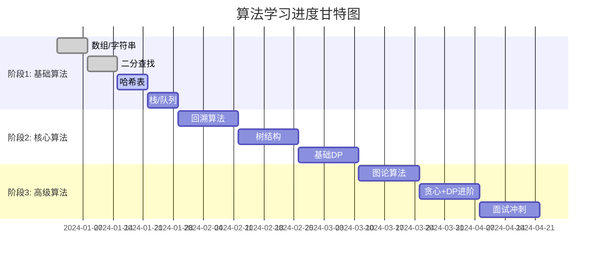
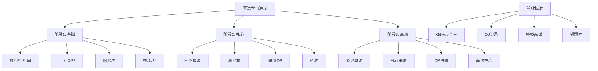

### 1. 每日学习记录表

| 日期       | 学习阶段 | 完成题目           | 题目类型    | 难度     | 用时(分钟) | 是否AC   | 关键收获     | 待改进点     | GitHub提交               |
| ---------- | -------- | ------------------ | ----------- | -------- | ---------- | -------- | ------------ | ------------ | ------------------------ |
| 2025-10-21 | 阶段1    | LC1, LC15, LC88    | 数组,双指针 | 易,中,中 | 180        | 是,是,是 | 双指针技巧   | 边界条件处理 | phase1/xxx.cpp           |
| 2025-10- | 阶段1    | LC704, LC34, LC35  | 二分查找    | 易,中,易 | 120        | 是,是,是 | 二分模板掌握 | 循环条件优化 | phase1/binary_search.cpp |
| 2025-10- | 阶段1    | LC20, LC155, LC225 | 栈          | 易,中,易 | 90         | 是,是,是 | 栈的应用场景 | 异常处理     | phase1/stack_demo.cpp    |

**填写说明：**

- 每日记录3题，按计划要求
- 记录具体题号和类型
- 标注是否一次性通过(AC)
- 记录GitHub提交路径

### 2. 每周进度汇总表

| 周次  | 阶段  | 完成题目数 | 模板实现数 | 单元测试数 | 模拟面试 | 周评分 | 关键里程碑          | 下周计划    |
| ----- | ----- | ---------- | ---------- | ---------- | -------- | ------ | ------------------- | ----------- |
| 第1周 | 阶段1 | 15题       | 3个        | 5个        | 无       | 8/10   | 数组/字符串基础     | 二分+哈希表 |
| 第2周 | 阶段1 | 15题       | 3个        | 6个        | 无       | 7/10   | 二分模板掌握        | 栈/队列应用 |
| 第3周 | 阶段1 | 15题       | 3个        | 6个        | 1次      | 8/10   | 哈希表熟练          | 双指针进阶  |
| 第4周 | 阶段1 | 15题       | 3个        | 8个        | 无       | 9/10   | **阶段1验收** | 进入阶段2   |

### 3. 验收清单表格

#### 阶段1验收清单（第4周末）

| 验收项目   | 目标要求    | 实际完成 | 是否达标  | 证明材料       |
| ---------- | ----------- | -------- | --------- | -------------- |
| GitHub模板 | 12个模板    | [填写]   | □是 □否 | [[phase1链接]] |
| 单元测试   | 8个题测试   | [填写]   | □是 □否 | [[测试截图]]   |
| OJ记录     | AC≥60题    | [填写]   | □是 □否 | [[AC记录]]     |
| 代码质量   | 注释+复杂度 | [填写]   | □是 □否 | [[代码审查]]   |

#### 阶段2验收清单（第8周末）

| 验收项目  | 目标要求    | 实际完成 | 是否达标  | 证明材料       |
| --------- | ----------- | -------- | --------- | -------------- |
| 回溯模板  | 5个实现     | [填写]   | □是 □否 | [[phase2链接]] |
| 树/链表题 | 5个完整解   | [填写]   | □是 □否 | [[实现记录]]   |
| OJ累计    | AC≥120题   | [填写]   | □是 □否 | [[累计记录]]   |
| 模拟面试  | 评分≥12/20 | [填写]   | □是 □否 | [[面试记录]]   |

#### 最终验收清单（第12周末）

| 验收项目 | 目标要求  | 实际完成 | 是否达标  | 证明材料       |
| -------- | --------- | -------- | --------- | -------------- |
| 总题量   | ~200题    | [填写]   | □是 □否 | [[总记录]]     |
| 图算法   | BFS/DFS等 | [填写]   | □是 □否 | [[phase3链接]] |
| DP实现   | 2个完整解 | [填写]   | □是 □否 | [[DP实现]]     |
| 模拟面试 | 6场有反馈 | [填写]   | □是 □否 | [[面试汇总]]   |

### 4. 学习进度可视化

5. 关键指标仪表盘

### 填写指南

1. **每日记录**：当天学习结束后立即填写
2. **每周汇总**：周日晚上进行周度复盘
3. **验收清单**：阶段结束时对照检查
4. **证明材料**：及时保存截图和链接

### 推荐工具

- **GitHub仓库**：[algorithms-2025](https://github.com/wasidj/algorithms-2025)
- **OJ平台**：[LeetCode](https://leetcode.com), [Codeforces](https://codeforces.com)
- **模拟面试**：[Pramp](https://www.pramp.com), [Interviewing.io](https://interviewing.io)
